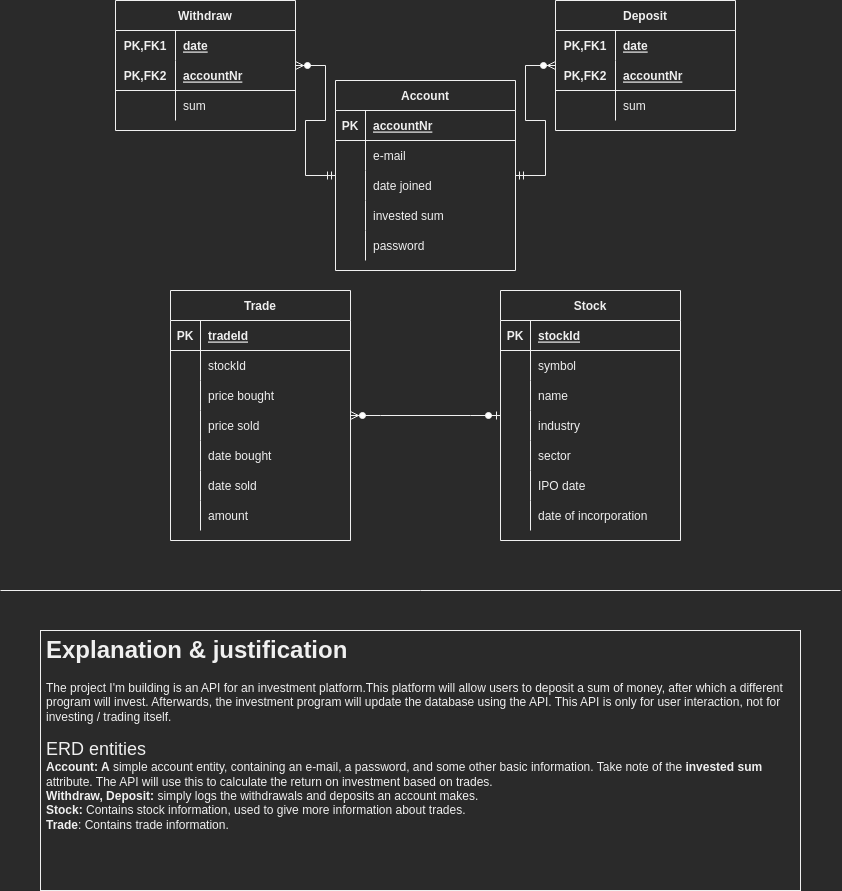
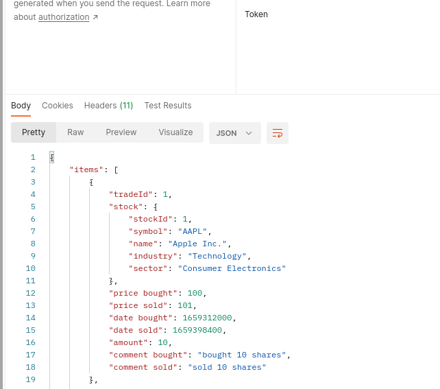
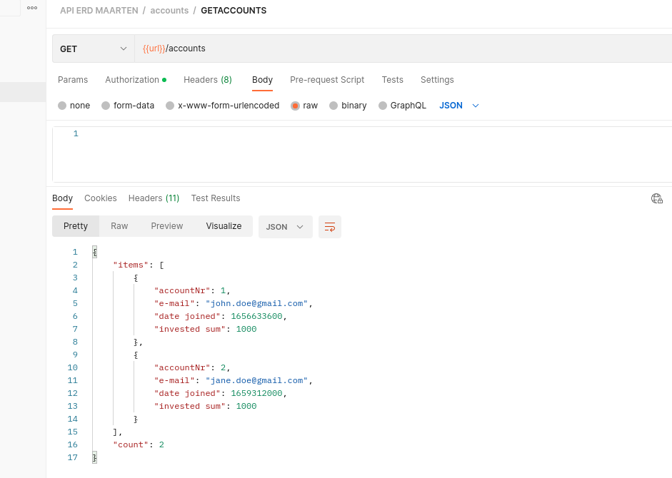
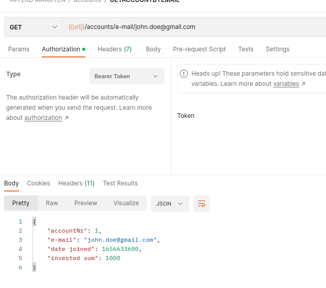
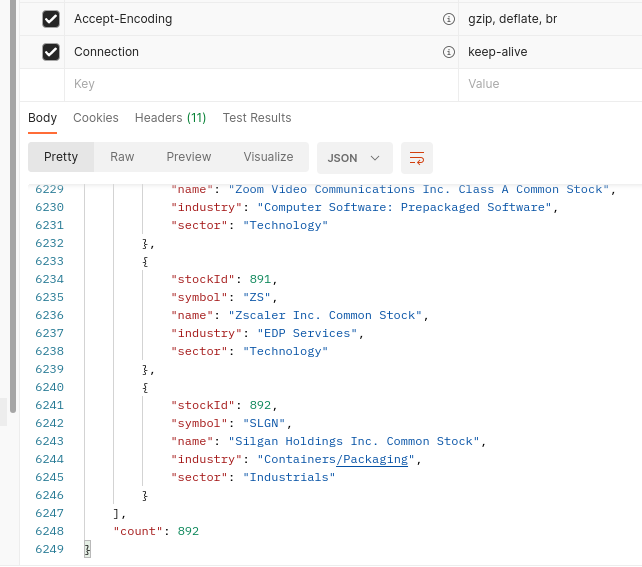
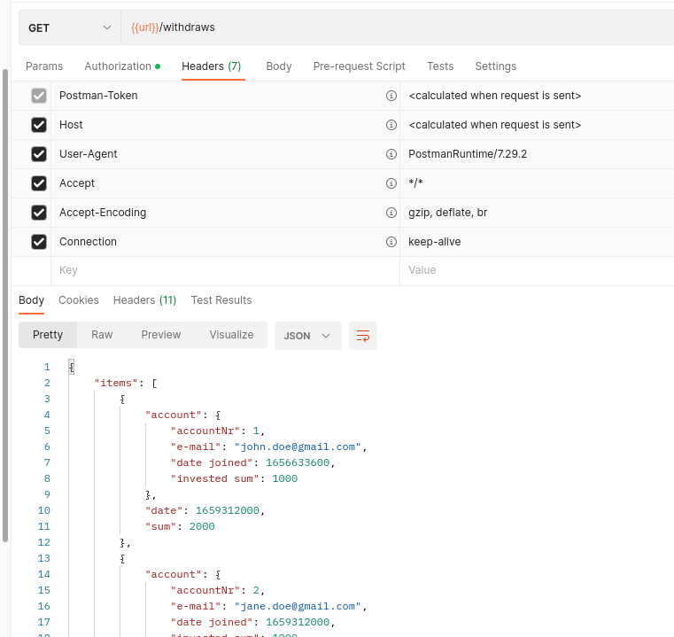
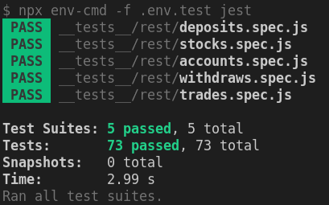
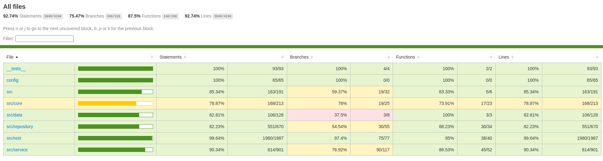

# Maarten Boon (Studentennummer)

- [x] Web Services: GITHUB URL
  - [GitHub repository](https://github.com/Web-IV/2223-webservices-MaartenBoonHoGent)
  - [Online versie](https://two223-webservices-maartenboonhogent.onrender.com/)

**Logingegevens**

##### Admin
- Gebruikersnaam/e-mailadres: `client@gmail.com`
- Wachtwoord: `client123!`

##### Tester
- Gebruikersnaam/e-mailadres: `tester@gmail.com`
- Wachtwoord: `Tester123!`

## Projectbeschrijving

Dit project is een API voor een imaginaire website voor een imaginair hedge-fund. Een hedge-fund heeft klanten, gerepresenteerd door de entiteit <b> Account </b>. Een klant kan geld bij het hedge-fund zetten (<b> Deposit </b>), of geld uit het hedge-fund halen (<b> Withdraw </b>). Met dit geld zal het hedge-fund dan aandelen (<b> Stock </b>) kopen en verkopen, en dit loggen als een <b> Trade </b>. Beide account-management en trade-management zijn mogelijk via de API.
##### ERD

## Screenshots

## Behaalde minimumvereisten
### Web Services

- **datalaag**

  - [x] voldoende complex (meer dan één tabel)
  - [x] één module beheert de connectie + connectie wordt gesloten bij sluiten server
  - [x] heeft migraties
  - [x] heeft seeds
 

- **repositorylaag**

  - [x] definieert één repository per entiteit (niet voor tussentabellen) - indien van toepassing
  - [x] mapt OO-rijke data naar relationele tabellen en vice versa
 

- **servicelaag met een zekere complexiteit**

  - [x] bevat alle domeinlogica
  - [x] bevat geen SQL-queries of databank-gerelateerde code
 

- **REST-laag**

  - [x] meerdere routes met invoervalidatie
  - [x] degelijke foutboodschappen
  - [x] volgt de conventies van een RESTful API
  - [x] bevat geen domeinlogica
  - [x] degelijke authorisatie/authenticatie op alle routes
 

- **varia**
  - [x] een aantal niet-triviale testen (min. 1 controller >=80% coverage)
  - [x] minstens één extra technologie
  - [x] duidelijke en volledige `README.md`
  - [x] maakt gebruik van de laatste ES6-features (object destructuring, spread operator...)
  - [x] volledig en tijdig ingediend dossier

## Projectstructuur

### Web Services

De structuur van de applicatie is als volgt:
- Datalaag, waar de connectie van de database ligt, samen met de migraties en seeds.
- Repositorylaag, waar de repositories van de entiteiten liggen. Deze zijn verantwoordelijk voor directe database operaties.
- Servicelaag, waar de services van de entiteiten liggen. Deze zijn verantwoordelijk voor de domeinlogica. Dit is errors, regels en validaties.
- REST-laag, waar de controllers van de entiteiten liggen. Deze zijn verantwoordelijk voor de routes en de communicatie met de services.
Verder is er een config-map, waar de configuratie van de applicatie ligt. Dit is de connectie met de database en de configuratie van de auth0. 
- Core, Waar alle classes en interfaces liggen die gebruikt worden in elke laag.

## Extra technologie

### Web Services

Voor de extra technologie heb ik gekozen voor Swagger. Dit is een tool die gebruikt kan worden om een API te documenteren. Swagger maakt documentatie gebaseerd op comments die geschreven zijn in de code. U kunt de documentatie vinden op de volgende link: https://two223-webservices-maartenboonhogent.onrender.com/api/swagger/. 

## Testresultaten

### Web Services

Elke route (GET, POST, PUT, DELETE) per entiteit wordt getest. De testen worden uitgevoerd in de map \__tests\__. Er wordt getest op het werken van de route, en de meest voorkomend fouten die vookomen. De testen worden uitgevoerd met `yarn test`, en om coverage te krijgen met `yarn test:coverage`. 

#### Foto's

## Gekende bugs

### Web Services
- Geen gekende bugs
## Wat is er verbeterd/aangepast?
### Web Services

N.V.T.
